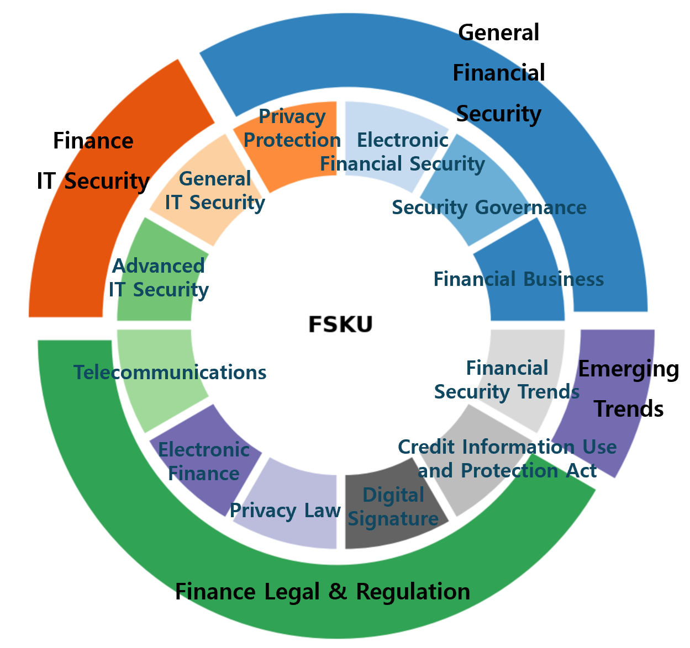

# FSKU: A Benchmark for Financial Security Knowledge Understanding

[](https://opensource.org/licenses/MIT)

**FSKU** is a novel Question-Answering (QA) benchmark designed to measure how well Large Language Models (LLMs) understand the practical, domain-specific knowledge required in the South Korean financial security landscape.

> ### Important Notice
>
> The FSKU benchmark and its related data will be used as an official task for the **2025 Financial AI Challenge (August 1 - August 29, 2025)**.
> [Challenge Page](https://www.fsec.or.kr/bbs/detail?menuNo=66&bbsNo=11704)
>
> Therefore, to ensure the fairness of the competition, detailed information about the benchmark, the full dataset, and the leaderboard scores will be **released after the competition period**.

## Overview

While recent LLMs have demonstrated remarkable capabilities, their proficiency in high-stakes domains like financial security—which requires high reliability for tasks such as fraud detection and regulatory compliance—remains under-explored. As seen in real-world failure cases at the Financial Security Institute (FSI) of South Korea, LLMs can often produce responses that are fluent but factually incorrect, posing significant risks in financial applications.

FSKU was created to address this gap. Based on authoritative sources such as official financial certification textbooks, laws, and supervisory guidelines, FSKU systematically evaluates whether LLMs possess the knowledge required for real-world tasks within financial institutions.

## Features of FSKU

* **Domain-Specific**: FSKU is the first benchmark to focus specifically on financial 'security,' including governance, IT security, regulatory compliance, and emerging threats, rather than general financial knowledge.
* **Grounded in Practice**: The benchmark is highly relevant to industry practice, as it is based on the curriculum of official national certifications like the Financial Security Manager (FSM) and actual laws (e.g., Electronic Financial Transactions Act, Credit Information Use and Protection Act).
* **Rigorous Quality Control**: Drafts were generated using a combination of real-world professional financial security documents and an LLM (GPT-4o). These drafts were then validated and revised by experts from the Financial Security Institute against eight quality criteria to ensure their reliability and validity.
* **Bilingual Support**: All data is provided in both Korean and English, making it accessible to researchers worldwide.

## Benchmark Structure

FSKU is hierarchically organized into 4 main domains and 12 sub-domains, allowing for a multi-faceted analysis of a model's performance and the identification of its weaknesses.

| Main Domain                  | Sub-domain (Data Ratio)                                                                                                                                              | Main Sources  |
| :--------------------------- | :------------------------------------------------------------------------------------------------------------------------------------------------------------------- | :------------ |
| **General Financial Security** | Financial Business (5.0%)<br>Security Governance (5.0%)<br>Electronic Security (5.0%)<br>Privacy (5.0%)                                                              | (Undisclosed) |
| **Finance IT Security** | General IT Security (8.0%)<br>Advanced IT Security (12.0%)                                                                                                            | (Undisclosed) |
| **Finance Legal & Regulation** | Electronic Finance (12.0%)<br>Telecommunications (12.0%)<br>Privacy Law (12.0%)<br>Digital Signature (7.0%)<br>Credit Information (12.0%)                                | (Undisclosed) |
| **Emerging Trends** | Financial Security Trends (5.0%)                                                                                                                                     | (Undisclosed) |

*To ensure the fairness of the competition, the main sources will be disclosed after the 2025 Financial AI Challenge.*


*Figure: FSKU Domain and Sub-domain Structure*

## Dataset Example

Each item consists of a question, four options, the correct answer, and a detailed explanation.

| Item         | Content                                                                                                                                                                                                                                                                                                                                                                              |
| :----------- | :----------------------------------------------------------------------------------------------------------------------------------------------------------------------------------------------------------------------------------------------------------------------------------------------------------------------------------------------------------------------------------- |
| **Domain** | Finance IT Security                                                                                                                                                                                                                                                                                                                                                                  |
| **Sub-domain** | Advanced Financial IT Security                                                                                                                                                                                                                                                                                                                                                       |
| **Question** | Which of the following is the most appropriate method to defend against Cross-Site Scripting (XSS) attacks among application security vulnerability countermeasures?                                                                                                                                                                                                                 |
| **Options** | (1) Database encryption<br>(2) Input validation and output encoding<br>(3) Strengthening network firewall settings<br>(4) Enhancing user authentication                                                                                                                                                                                                                               |
| **Answer** | (2) Input validation and output encoding                                                                                                                                                                                                                                                                                                                                             |
| **Explanation**| A Cross-Site Scripting (XSS) attack is an attack where malicious scripts are injected into a webpage, causing them to be executed in the user's browser. To defend against this, it is essential to thoroughly validate data received from the user and properly encode it before outputting it to the webpage to prevent the script from being executed. |

| Item         | Content                                                                                                                                                                                                                                                                                                                                                  |
| :----------- | :------------------------------------------------------------------------------------------------------------------------------------------------------------------------------------------------------------------------------------------------------------------------------------------------------------------------------------------------------- |
| **Domain** | Financial Security Trends                                                                                                                                                                                                                                                                                                                                |
| **Sub-domain** | Latest Trends in Financial Security                                                                                                                                                                                                                                                                                                                      |
| **Question** | What is the primary function of an SBOM (Software Bill of Materials)?                                                                                                                                                                                                                                                                                    |
| **Options** | (1) To list all components of the S/W supply chain to quickly identify security vulnerabilities.<br>(2) To enhance security by recording all transaction details of a financial company.<br>(3) To automatically fix all errors that occur during the S/W development process.<br>(4) To prevent information leakage by encrypting financial data.            |
| **Answer** | (1) To list all components of the S/W supply chain to quickly identify security vulnerabilities.                                                                                                                                                                                                                                                           |
| **Explanation**| An SBOM is a specification that helps in the rapid identification of security vulnerabilities by listing the components and package information of a software supply chain. Through this, the financial sector can prevent S/W supply chain attacks and enhance its security. |

| Item         | Content                                                                                                                                                                                                                                                                                                                                                     |
| :----------- | :---------------------------------------------------------------------------------------------------------------------------------------------------------------------------------------------------------------------------------------------------------------------------------------------------------------------------------------------------------- |
| **Domain** | Financial Security Law                                                                                                                                                                                                                                                                                                                                      |
| **Sub-domain** | Electronic Finance                                                                                                                                                                                                                                                                                                                                          |
| **Question** | Which of the following is an incorrect statement regarding the transferability of electronic money?                                                                                                                                                                                                                                                         |
| **Options** | (1) Electronic money can be transferred to others according to the agreement with the issuer.<br>(2) It can be transferred even if the real name of the holder is not verified.<br>(3) Electronic money cannot be provided as collateral.<br>(4) Transfers must go through the issuer's central processing system.                                               |
| **Answer** | (3) Electronic money cannot be provided as collateral.                                                                                                                                                                                                                                                                                                      |
| **Explanation**| According to the agreement with the issuer, electronic money can be transferred to others or provided as collateral. However, when transferring or providing it as collateral, it must go through the issuer's central processing system. Transfers are possible even if the holder's real name is not verified. |

| Item         | Content                                                                                                                                                                                                                                                                                                                                                                                                                        |
| :----------- | :----------------------------------------------------------------------------------------------------------------------------------------------------------------------------------------------------------------------------------------------------------------------------------------------------------------------------------------------------------------------------------------------------------------------------- |
| **Domain** | General Financial Security                                                                                                                                                                                                                                                                                                                                                                                                     |
| **Sub-domain** | Financial Security Management System                                                                                                                                                                                                                                                                                                                                                                                           |
| **Question** | What is the primary purpose of a Personal Information Impact Assessment (PIA)?                                                                                                                                                                                                                                                                                                                                                 |
| **Options** | (1) To increase the efficiency of personal information processing systems<br>(2) To proactively prevent personal information breaches<br>(3) To reduce the costs of processing personal information<br>(4) To automate personal information processing systems                                                                                                                                                                        |
| **Answer** | (2) To proactively prevent personal information breaches                                                                                                                                                                                                                                                                                                                                                                       |
| **Explanation**| A Personal Information Impact Assessment (PIA) is a procedure to investigate in advance the impact on personal information and devise improvement measures when introducing a new information system that handles personal information files or making significant changes to an existing system. It is conducted for the purpose of proactively preventing personal information breaches. |

## Leaderboard

The following are the results from an evaluation of 11 representative LLMs. The findings indicate that models generally struggle with the legal and regulatory domains.

The chart below shows the average accuracy across all 11 LLMs for each sub-domain, illustrating the overall difficulty landscape of the benchmark.

| Model | Overall Accuracy | Finance Legal & Regulation | Finance IT Security |
| :--- | :---: | :---: | :---: |
| **claude-4** | (Undisclosed) | (Undisclosed) | (Undisclosed) |
| gpt-4.1 | (Undisclosed) | (Undisclosed) | (Undisclosed) |
| ... | ... | ... | ... |

*To ensure the fairness of the competition, detailed scores will be disclosed after the 2025 Financial AI Challenge.*

## Evaluation Method

Models are evaluated in a zero-shot setting without fine-tuning. As all questions are multiple-choice with four options, accuracy is measured by extracting the first numerical token from the model's response and comparing it to the correct answer.

### Running the Evaluation Script (Example)

```python
python evaluate.py \
    --model_name "gpt-4.1" \
    --data_path "./data/fsku_test.csv" \
    --output_dir "./results"